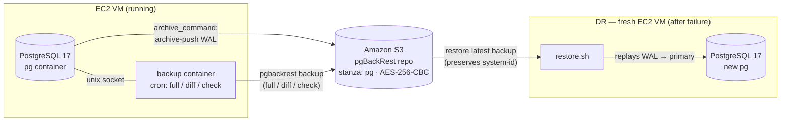

# pg-physical-backup

Physical PostgreSQL backup and disaster recovery using **pgBackRest → Amazon S3**, orchestrated by Docker Compose. A single PostgreSQL 17 instance streams its WAL to S3 continuously, takes scheduled base backups, and can be rebuilt on a fresh EC2 VM from the latest backup.

## Architecture



## How it works

| Component | Role |
|---|---|
| `pg` | PostgreSQL 17 + pgBackRest. Runs `archive_mode=on`; every WAL segment is pushed to S3 via `archive-push`. |
| `backup` | Debian + cron + pgBackRest. Schedules full / differential backups and health checks against the same stanza. |
| S3 | pgBackRest repo (bucket), holding the base backups + WAL archives. Client-side AES-256-CBC encrypted. |

**Startup flow (`start.sh`):**

1. Sources `.env`, `sed`-substitutes `configs/*.conf.tmpl` → real `.conf`.
2. Creates + `chown 999:999` the data/socket/spool directories.
3. Builds images and starts `pg` (runs `initdb` on first boot).
4. Waits for PG, then runs `stanza-create` **idempotently** if the stanza doesn't exist yet.
5. Starts the `backup` scheduler.

**Disaster recovery (`restore.sh`):** on a fresh/replacement EC2 VM, it wipes the local data dir, restores the latest backup from S3, and starts PG — which replays WAL and comes up as the primary.

## Repository layout

```
.
├── docker-compose.yml                 # pg + backup services
├── start.sh                           # generate configs, build, start pg + backup
├── restore.sh                         # DR: restore latest backup on a fresh host
├── .env.example                       # all configuration
├── pg/
│   └── Dockerfile                     # postgres:17 + pgBackRest
├── backup/
│   ├── Dockerfile                     # cron + pgBackRest
│   └── entrypoint.sh                  # renders /etc/cron.d/pgbackrest from .env
├── configs/
│   ├── pg-pgbackrest.conf.tmpl        # archive-push / archive-get config
│   └── backup-pgbackrest.conf.tmpl    # backup config (retention/compression)
└── pgadmin/                           # optional pgAdmin UI
    ├── docker-compose.yml             # pgAdmin service (host port 5435)
    ├── .env.example                   # pgAdmin login
    └── servers.json.example           # pre-configured server
```

## Prerequisites

- An S3 bucket for the pgBackRest repo.
- AWS credentials: an EC2 **IAM instance profile** with S3 access to that bucket (`repo1-s3-key-type=auto`). Alternatively, static keys via `AWS_ACCESS_KEY_ID` / `AWS_SECRET_ACCESS_KEY`.
- The same `PGBACKREST_CIPHER_PASS` on every host that touches the repo (generate with `openssl rand -base64 48`).

## Quick start (fresh deploy)

```bash
cp .env.example .env        # set S3_BUCKET, PGBACKREST_CIPHER_PASS (keep STANZA default)
./start.sh
```

`start.sh` auto-creates the stanza, so archiving and the backup cron work immediately. If you need to create it manually (or the auto-create didn't run):

```bash
docker exec -u postgres pg pgbackrest --stanza=pg stanza-create
```

Verify:

```bash
docker exec pg psql -U postgres -c "SELECT pg_is_in_recovery();"   # expect f (primary)
docker exec -u postgres pg pgbackrest --stanza=pg info             # stanza exists
```

## Disaster recovery (fresh host)

```bash
cp .env.example .env        # SAME S3_BUCKET / PGBACKREST_CIPHER_PASS / STANZA as source
./restore.sh
```

Restores the latest backup (preserving the database **system-identifier**), replays WAL, and starts PG as the primary. Then confirm:

```bash
docker exec pg psql -U postgres -c "SELECT pg_is_in_recovery();"   # expect f
```

## Configuration reference (`.env`)

| Variable | Default | Purpose |
|---|---|---|
| `STANZA` | `pg` | pgBackRest stanza name (one DB = one stanza) |
| `POSTGRES_USER` / `POSTGRES_PASSWORD` | `postgres` / `changeme` | PG superuser |
| `S3_BUCKET` | — | pgBackRest repo bucket (required) |
| `AWS_DEFAULT_REGION` | `us-east-1` | S3 region |
| `S3_ENDPOINT` | `s3.us-east-1.amazonaws.com` | S3 endpoint |
| `PGBACKREST_CIPHER_PASS` | `changeme` | AES-256-CBC passphrase (required) |
| `RETENTION_FULL` / `RETENTION_DIFF` | `2` / `4` | Backup retention (count) |
| `ARCHIVE_TIMEOUT` | `60` | PG `archive_timeout` (seconds) — forces a WAL switch |
| `BACKUP_FULL_CRON` | `"07 2 * * 0"` | Full backup schedule (Sun 02:07) |
| `BACKUP_DIFF_CRON` | `"07 2 * * 1-6"` | Differential schedule (Mon–Sat 02:07) |
| `BACKUP_CHECK_CRON` | `"17 7 * * *"` | Health check schedule (daily 07:17) |
| `COMPRESS_LEVEL` / `COMPRESS_LEVEL_NETWORK` / `PROCESS_MAX` | `6` / `3` / `4` | Optional overrides |

Cron values contain spaces → keep them **quoted** in `.env` (`start.sh` sources it with `source`).

## Core concepts (read before debugging)

**WAL archive ≠ base backup.** A stanza holds two things: WAL segments (from `archive-push`) and base backups (from `pgbackrest backup`). `pgbackrest info` lists *base* backups — a stanza can have WAL yet show "no backups".

**A stanza is bound to the database's `system_identifier`.** This ID is generated once at `initdb` and never changes — through backups, restores, and promotion. pgBackRest stamps it into the stanza and rejects WAL/backups whose ID doesn't match.

**Restore preserves the system-id; `initdb` does not.** Restoring a backup onto a fresh host reproduces the *same* system-id, so archiving to the same stanza keeps working. But starting PG on an **empty data dir** runs `initdb` → a **new** system-id → `ArchiveMismatchError`. Hence the golden rule: **never let `initdb` run before a restore** — `restore.sh` wipes and restores in the right order.

**Reconciling a stale stanza.** If a data dir was re-`initdb`'d (or a different DB restored over it), the stanza no longer matches. Fix it by deleting and recreating the stanza:

```bash
docker exec -u postgres pg pgbackrest --stanza=pg stop
docker exec -u postgres pg pgbackrest --stanza=pg stanza-delete --force
docker exec -u postgres pg pgbackrest --stanza=pg stanza-create
```

## Troubleshooting

Cron job output does **not** appear in `docker logs` (Debian cron has no syslog/MTA in the container). The real logs are in pgBackRest's own file:

```bash
docker exec pg-cron-backup tail -f /var/log/pgbackrest/pgbackrest.log
```

Common errors:

| Error | Meaning | Fix |
|---|---|---|
| `FileMissingError … archive.info` / "has a stanza-create been performed?" | Stanza doesn't exist | `stanza-create` (auto in `start.sh`) |
| `ArchiveMismatchError` / `[028] info files exist but do not match` | Stanza bound to a different DB instance (re-initdb or restored another DB) | `stanza-delete --force` + `stanza-create` |
| `[040] unable to restore … contains files` | Restore target is not empty | Wipe the data dir first (`restore.sh` does this) |
| `[055] stop file does not exist` | `stanza-delete` requires a prior `stop` | Run `pgbackrest … stop` first |
| `[038] postmaster.pid exists` | PG is running during `stanza-delete` | Add `--force` |
| `[037] archive-get requires pg1-path` / "does this stanza exist?" | `restore_command` can't resolve the stanza (missing/broken) | Reconcile the stanza |

## Useful commands

```bash
# Stanza + backup state
docker exec -u postgres pg pgbackrest --stanza=pg info
docker exec -u postgres pg pgbackrest --stanza=pg check

# Force an immediate WAL archive (diagnostics)
docker exec pg psql -U postgres -c "SELECT pg_switch_wal();"

# Run a manual full backup
docker exec -u postgres pg-cron-backup pgbackrest --stanza=pg --type=full backup --log-level-console=info

# Point-in-time restore (on a fresh host, before starting PG)
docker exec -u postgres pg pgbackrest --stanza=pg --type=time="2026-08-19 05:00:00" restore
```
