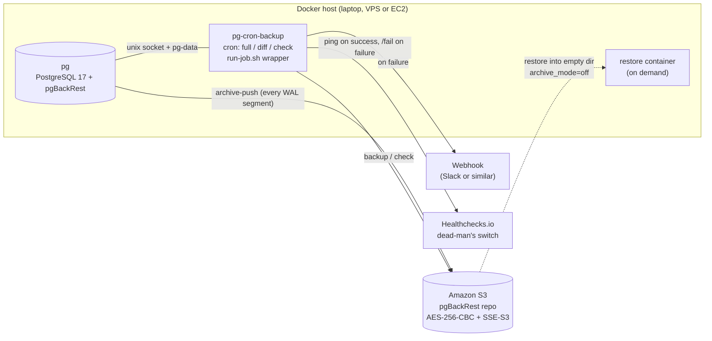

# pg-physical-backup

[](https://github.com/joheee/PgPhysicalBackup/actions/workflows/checks.yml)

Physical PostgreSQL 17 backups with **pgBackRest → Amazon S3**, run by Docker Compose: continuous WAL archiving, scheduled full and differential backups, client-side AES-256 encryption, alerts when a job fails or stops running, and a script to rebuild a host from the latest backup.

The goal of the project is **backups you can prove restore, with measured numbers**. A throwaway `restore` container now restores from S3, checks the result and writes a report; the scripted drill that exercises every scenario is still planned. See [Status](#status).

## Status

| Area | State |
|---|---|
| WAL archiving to S3, scheduled full / diff / `check` jobs, encryption | Built. First real full backup and `check` succeeded on S3. |
| Hardening (region, data checksums, localhost ports, pinned versions, no secrets in cron files, confirmed wipes) | Built and tested. |
| Failure alerts (non-zero exit, webhook, dead-man's switch) | Built. Tested against a stand-in listener; not yet seen with a real Slack / Healthchecks.io endpoint. |
| Readable logs (schedule table, countdown, live view) | Built and tested. |
| CI (`checks.yml`: shellcheck, hadolint, actionlint, compose config) | Built; every step passes locally. |
| `restore` container: latest, point-in-time, named restore point, older set and delta restores into an empty directory with `archive_mode=off`, checks, Markdown + JSON report | Built and run against the real S3 stanza. All scenarios pass except single-database, which needs a user database (see below). |
| `drill/run.sh`: self-contained drill on a throwaway stanza with seeded data (RPO, row-count checks, `verify`, failure scenario) | **Planned.** The container already supports its expectation file; no data has been seeded yet. |
| Single-database restore, 10 GB benchmark, committed sample reports | **Planned.** |

So far the measured numbers come from a 22 MB test database (see [Measured so far](#measured-so-far)). RPO has not been measured yet, because it needs the drill's canary data.

## Architecture


```mermaid
flowchart LR
    subgraph HOST["Docker host (laptop, VPS or EC2)"]
        PG[("pg<br/>PostgreSQL 17 + pgBackRest")]
        BK["pg-cron-backup<br/>cron: full / diff / check<br/>run-job.sh wrapper"]
        RS["restore container<br/>(on demand)"]
        PG ---|"unix socket + pg-data"| BK
    end

    S3[("Amazon S3<br/>pgBackRest repo<br/>AES-256-CBC + SSE-S3")]
    WH["Webhook<br/>(Slack or similar)"]
    HC["Healthchecks.io<br/>dead-man's switch"]

    PG -->|"archive-push (every WAL segment)"| S3
    BK -->|"backup / check"| S3
    BK -->|"on failure"| WH
    BK -->|"ping on success, /fail on failure"| HC
    S3 -.->|"restore into empty dir<br/>archive_mode=off"| RS
```

| Component | Role |
|---|---|
| `pg` | PostgreSQL 17 with pgBackRest. `archive_mode=on`, so every WAL segment goes to S3. Data checksums are on. |
| `pg-cron-backup` | Debian + cron + pgBackRest. Runs the jobs through `run-job.sh` and prints the schedule and countdown. Shares `pg-data` (read-only) and the socket with `pg`. |
| S3 bucket | The pgBackRest repository: base backups and WAL archive, encrypted client-side and with SSE-S3. |
| `pgadmin` (optional) | Web UI behind the `pgadmin` Compose profile, localhost only. |

## Repository layout

```
.
├── docker-compose.yml          # project "pgdemo": pg, backup, pgadmin (profile)
├── start.sh                    # generate configs, build, start pg + backup, create stanza
├── restore.sh                  # DR: rebuild this host from the latest backup
├── .env.example                # all configuration (copy to .env, chmod 600)
├── pg/Dockerfile               # postgres:17.11 (digest-pinned) + pgBackRest 2.60.0
├── restore/
│   ├── Dockerfile              # same base + pgBackRest, plus jq
│   ├── entrypoint.sh           # preflight → restore → start → wait → checks → report → clean up
│   ├── checks.sh               # generic checks and the EXPECT_FILE checks
│   └── report.sh               # JSON + Markdown report
├── reports/                    # restore reports (git-ignored; copy keepers to docs/reports/)
├── backup/
│   ├── Dockerfile
│   ├── entrypoint.sh           # root-only job env file, schedule-only crontab, startup table
│   ├── run-job.sh              # wraps every job: logs, duration, webhook alert, health ping
│   ├── status.sh               # next run times
│   └── countdown.sh            # countdown lines for docker logs, or --live
├── configs/
│   ├── pg-pgbackrest.conf.tmpl     # archive-push / archive-get
│   └── backup-pgbackrest.conf.tmpl # backup, retention, compression
└── .github/workflows/checks.yml
```

`configs/*.conf` and `configs/s3-keys.env` are generated by `start.sh` and git-ignored.

## Quick start

You need Docker with Compose, plus an S3 bucket and IAM credentials ([AWS setup](#aws-setup)).

```bash
cp .env.example .env
chmod 600 .env           # it holds the passphrase and the S3 keys
$EDITOR .env             # bucket, keys, passphrase, passwords
./start.sh
```

`start.sh` refuses to run while `PGBACKREST_CIPHER_PASS` is still `changeme`. Generate a real one with `openssl rand -base64 48` and keep it safe: **without it the backups cannot be read**.

`start.sh` generates the configs, builds the images, starts `pg`, creates the stanza if it doesn't exist, then starts the backup container. Verify and take the first backup:

```bash
docker exec pg psql -U postgres -c "SHOW data_checksums;"                 # on
docker exec -u postgres pg pgbackrest --stanza=pg check                   # WAL reaches S3
docker exec -u postgres pg-cron-backup pgbackrest --stanza=pg --type=full backup
docker exec -u postgres pg pgbackrest --stanza=pg info                    # backup listed
```

`POSTGRES_PASSWORD` and the data checksum setting apply only when `pg-data` is first created. See [Troubleshooting](#troubleshooting) to change a password later.

## AWS setup

Everything runs locally; AWS is used only for S3 and IAM, in `ap-southeast-2`. The bucket and IAM user are created by hand (there is no infrastructure code in this repo). Set `BUCKET` to a globally unique name and run these with admin credentials in your own account.

### 1. Bucket

Required settings: public access blocked, bucket-owner-enforced ownership, SSE-S3, versioning on, and lifecycle rules **only** for old versions, incomplete uploads and the `drill/` prefix. Never add an expiry rule to the live repository path (`pgbackrest/`): pgBackRest owns retention there and expiring files under it breaks the backup chain.

```bash
BUCKET=my-unique-pgbackrest-bucket
REGION=ap-southeast-2

aws s3api create-bucket --bucket "$BUCKET" --region "$REGION" \
  --create-bucket-configuration LocationConstraint="$REGION"
aws s3api put-public-access-block --bucket "$BUCKET" --public-access-block-configuration \
  BlockPublicAcls=true,IgnorePublicAcls=true,BlockPublicPolicy=true,RestrictPublicBuckets=true
aws s3api put-bucket-ownership-controls --bucket "$BUCKET" \
  --ownership-controls 'Rules=[{ObjectOwnership=BucketOwnerEnforced}]'
aws s3api put-bucket-encryption --bucket "$BUCKET" --server-side-encryption-configuration \
  '{"Rules":[{"ApplyServerSideEncryptionByDefault":{"SSEAlgorithm":"AES256"}}]}'
aws s3api put-bucket-versioning --bucket "$BUCKET" --versioning-configuration Status=Enabled
aws s3api put-bucket-tagging --bucket "$BUCKET" \
  --tagging 'TagSet=[{Key=project,Value=pg-physical-backup},{Key=environment,Value=demo}]'
aws s3api put-bucket-lifecycle-configuration --bucket "$BUCKET" --lifecycle-configuration file://lifecycle.json
```

`lifecycle.json`:

```json
{
  "Rules": [
    { "ID": "noncurrent-versions", "Status": "Enabled", "Filter": {},
      "NoncurrentVersionExpiration": { "NoncurrentDays": 7 } },
    { "ID": "abort-incomplete-multipart-uploads", "Status": "Enabled", "Filter": {},
      "AbortIncompleteMultipartUpload": { "DaysAfterInitiation": 7 } },
    { "ID": "expired-delete-markers", "Status": "Enabled", "Filter": {},
      "Expiration": { "ExpiredObjectDeleteMarker": true } },
    { "ID": "expire-drill-prefix", "Status": "Enabled", "Filter": { "Prefix": "drill/" },
      "Expiration": { "Days": 7 } }
  ]
}
```

Versioning plus the 7-day noncurrent rule means a deleted backup file stays recoverable for a week. Optionally also deny non-TLS requests with a bucket policy on `aws:SecureTransport = false`.

### 2. IAM policy and user

pgBackRest needs four S3 actions. This policy grants them on the two prefixes only:

```json
{
  "Version": "2012-10-17",
  "Statement": [
    {
      "Sid": "ListRepoPrefixes",
      "Effect": "Allow",
      "Action": "s3:ListBucket",
      "Resource": "arn:aws:s3:::YOUR-BUCKET",
      "Condition": {
        "StringLike": { "s3:prefix": ["pgbackrest", "pgbackrest/*", "drill", "drill/*"] }
      }
    },
    {
      "Sid": "ReadWriteRepoObjects",
      "Effect": "Allow",
      "Action": ["s3:GetObject", "s3:PutObject", "s3:DeleteObject"],
      "Resource": [
        "arn:aws:s3:::YOUR-BUCKET/pgbackrest/*",
        "arn:aws:s3:::YOUR-BUCKET/drill/*"
      ]
    }
  ]
}
```

It deliberately omits `s3:DeleteObjectVersion`: on a versioned bucket `DeleteObject` only adds a delete marker, so a leaked key cannot permanently destroy backups within the 7-day window. It also grants nothing on the bucket configuration, IAM or EC2. The `s3:prefix` condition on `ListBucket` is the part most likely to need loosening if pgBackRest lists a path the condition doesn't cover; if you see `AccessDenied` on a list call, widen it first.

```bash
USER=pg-physical-backup-demo
aws iam create-user --user-name "$USER" \
  --tags Key=project,Value=pg-physical-backup Key=environment,Value=demo
aws iam put-user-policy --user-name "$USER" --policy-name pgbackrest-repo \
  --policy-document file://iam-policy.json          # the JSON above, with your bucket name
aws iam create-access-key --user-name "$USER"       # the secret is shown once
```

Put the access key pair only in `.env` (mode 600). Never in the repo, a ticket or a chat. Deactivate it when you aren't running demos:

```bash
aws iam update-access-key --user-name "$USER" --access-key-id AKIA... --status Inactive
```

### 3. On EC2 instead of a laptop

Attach the same policy to an **instance profile role** and leave `PGBACKREST_AWS_ACCESS_KEY_ID` / `PGBACKREST_AWS_SECRET_ACCESS_KEY` unset. `start.sh` then selects `repo1-s3-key-type=auto` and no keys exist anywhere. Off EC2, `auto` hangs probing the instance metadata endpoint, so use static keys there.

### Cost

S3 storage only, under about $1 a month with the default retention (2 full and 4 differential backups, WAL expired by pgBackRest). There is no always-on compute: the demo runs on your machine. Restores download from S3 and the first 100 GB a month of data out to the internet is free.

## Configuration (`.env`)

| Variable | Default | Purpose |
|---|---|---|
| `PGBACKREST_STANZA` | `pg` | Stanza name (one database = one stanza) |
| `POSTGRES_USER` / `POSTGRES_PASSWORD` | `postgres` / `changeme` | Superuser. The password applies on first init only. |
| `PGBACKREST_S3_BUCKET` | — | Repo bucket (required) |
| `PGBACKREST_AWS_DEFAULT_REGION` | `ap-southeast-2` | S3 region |
| `PGBACKREST_S3_ENDPOINT` | `s3.ap-southeast-2.amazonaws.com` | S3 endpoint |
| `PGBACKREST_AWS_ACCESS_KEY_ID` / `..._SECRET_ACCESS_KEY` | — | Static IAM user keys (laptop, VPS). Unset on EC2. |
| `PGBACKREST_CIPHER_PASS` | `changeme` (refused) | AES-256-CBC passphrase. Required, same on every host that touches the repo. |
| `PGBACKREST_RETENTION_FULL` / `_DIFF` | `2` / `4` | Retention by count |
| `PGBACKREST_ARCHIVE_TIMEOUT` | `60` | Postgres `archive_timeout` and pgBackRest `archive-timeout` (seconds) |
| `PGBACKREST_BACKUP_FULL_CRON` | `"07 2 * * 0"` | Full backup, Sunday 02:07 **UTC** |
| `PGBACKREST_BACKUP_DIFF_CRON` | `"07 2 * * 1-6"` | Differential, Monday to Saturday 02:07 UTC |
| `PGBACKREST_BACKUP_CHECK_CRON` | `"17 7 * * *"` | `pgbackrest check`, daily 07:17 UTC |
| `ALERT_WEBHOOK_URL` | unset | Failure alert target (Slack-compatible `{"text": ...}`) |
| `HEALTHCHECK_URL_FULL` / `_DIFF` / `_CHECK` | unset | One Healthchecks.io check per job |
| `COUNTDOWN_INTERVAL_SECONDS` | `1` | Seconds between countdown lines in `docker logs`; `0` = off |
| `PGADMIN_DEFAULT_EMAIL` / `_PASSWORD` | `admin@test.com` / unset | pgAdmin login (profile `pgadmin`) |
| `PGBACKREST_COMPRESS_LEVEL`, `_COMPRESS_LEVEL_NETWORK`, `_PROCESS_MAX` | `6`, `3`, `4` | Optional tuning. `_PROCESS_MAX` is also the worker count of the restore container. |
| `RESTORE_*`, `EXPECT_FILE` | unset | Restore container scenarios, see [Restore container](#restore-container) |

Cron values contain spaces, so keep them **quoted** (`start.sh` sources the file). All cron times are UTC.

## Running it

### Logs and countdown

```bash
docker logs -f pg-cron-backup
```

At start the container prints the next run of each job, then a countdown line every second, and after every job a result line:

```
Next scheduled jobs (now: Fri 2026-11-06 19:25 UTC):
  Differential backup  [06:41:24]  Sat 2026-11-07 02:07 UTC
  Health check         [11:51:24]  Sat 2026-11-07 07:17 UTC
  Full backup          [30:41:24]  Sun 2026-11-08 02:07 UTC
...
2026-11-06T19:25:39Z [countdown] Differential backup [06:41:21] | Health check [11:51:21] | Full backup [30:41:21]
2026-11-06T19:58:08Z [check] Health check: finished OK in 0m 5s
2026-11-06T19:58:08Z [scheduler] next: Differential backup [06:41:19] | ...
```

Extra commands:

```bash
docker exec -it pg-cron-backup countdown.sh --live   # one line that redraws in place; stores nothing; Ctrl-C quits
docker exec pg-cron-backup status.sh                 # next run times
docker logs pg-cron-backup 2>&1 | grep -v '\[countdown\]'   # job output without the countdown
```

Docker logs can only append lines, so the in-place redraw lives in `--live`, not in the log pane. Log storage is capped: the `local` driver, `max-size: 37m` (about 3 days at one line per second), `max-file: 2`, rotated files compressed, so disk use peaks near 38 MiB. Docker rotates by size, not time: if you change `COUNTDOWN_INTERVAL_SECONDS`, change `max-size` in proportion (interval `10` → `370m`). The per-file `backup file` lines pgBackRest prints are filtered out of the log.

### Alerts

Every job runs through `backup/run-job.sh`. On failure it exits non-zero, writes the error to `docker logs`, posts the last lines of output to `ALERT_WEBHOOK_URL`, and pings `<healthcheck-url>/fail`. On success it pings the check URL, so a job that silently stops running is caught by the missed ping.

1. Create three checks at [healthchecks.io](https://healthchecks.io) (free tier): one for each job, with periods that match the schedule (daily for `diff` and `check`, weekly for `full`) and a grace time. Put the ping URLs in `HEALTHCHECK_URL_FULL`, `_DIFF`, `_CHECK`.
2. Create an incoming webhook in Slack (or a Slack-compatible one such as Discord's `/slack` endpoint) and set `ALERT_WEBHOOK_URL`.
3. `docker compose up -d backup` to pick up the new values.

Both are optional; with neither set, failures appear only in `docker logs`, and the container prints a warning at start. The failure path (non-zero exit, log output, webhook JSON, `/fail` ping) has been tested against a stand-in listener, not against a real Slack or Healthchecks.io endpoint. To try it with your own, run a job with broken credentials:

```bash
docker exec pg-cron-backup /usr/local/bin/run-job.sh check check     # note the exit code
```

### Routine commands

```bash
docker exec -u postgres pg pgbackrest --stanza=pg info          # backups and WAL range
docker exec -u postgres pg pgbackrest --stanza=pg check         # archive and repo sanity
docker exec -u postgres pg-cron-backup pgbackrest --stanza=pg --type=full backup
docker exec pg psql -U postgres -c "SELECT pg_switch_wal();"    # force a WAL segment out
```

### pgAdmin (optional)

```bash
docker compose --profile pgadmin up -d pgadmin      # http://localhost:5435
```

Set `PGADMIN_DEFAULT_PASSWORD` in `.env` first. Register the server with **host `pg`, port `5432`**, user `postgres` and your `POSTGRES_PASSWORD`. Not `localhost`: inside the pgAdmin container that is pgAdmin itself. From tools on your machine use `127.0.0.1:5434`. The `pgadmin-data` directory must be owned by uid 5050.

### Restore container

Proves a backup restores, without touching the running database. It never mounts `pg-data`: it restores into its own named volume (`pgdemo_restore-data`), starts Postgres on a unix socket only with `archive_mode=off`, waits for recovery to finish, runs the checks, writes a report and exits. Needs `./start.sh` to have run once (it generates the config and creates `reports/`).

```bash
docker compose run --rm restore                 # latest backup of the real stanza
```

The container exists only while a run is in progress (about 1.5 minutes for the test database) and is deleted afterwards (`--rm`); it never shows in `docker compose ps`. What stays: the `pgdemo-restore` image, the (emptied) volume and `./reports/`.

Scenarios are chosen with environment variables:

```bash
RESTORE_TYPE=time RESTORE_TARGET="2026-11-06 20:04:01+00" docker compose run --rm restore   # point-in-time
RESTORE_TYPE=name RESTORE_TARGET=pre_migration            docker compose run --rm restore   # named restore point
RESTORE_SET=20261106-183638F                              docker compose run --rm restore   # older backup set
RESTORE_DB_INCLUDE=appdb                                  docker compose run --rm restore   # one user database
RESTORE_KEEP=1 docker compose run --rm restore            # keep the restored data...
RESTORE_DELTA=1 docker compose run --rm restore           # ...then repair it, fetching changed files only
RESTORE_VERIFY=1 docker compose run --rm restore          # also run `pgbackrest verify` on the whole repo
```

| Variable | Meaning |
|---|---|
| `RESTORE_TYPE` / `RESTORE_TARGET` | `time` (a timestamp with a zone, such as `2026-11-06 20:04:01+00`) or `name` (a restore point). Always `--target-action=promote`. |
| `RESTORE_SET` | A backup label from `pgbackrest info` |
| `RESTORE_DB_INCLUDE` | A **user** database. pgBackRest always restores system databases, and the container rejects `postgres`, `template0` and `template1`. The other user databases come back as empty placeholders and must be dropped. |
| `RESTORE_DELTA` | `1` restores onto an existing directory and only fetches changed files |
| `RESTORE_KEEP` | `1` keeps the restored data after the run (clear it with `docker volume rm pgdemo_restore-data`) |
| `RESTORE_VERIFY` | `1` also runs `pgbackrest verify` (downloads the whole repository) |
| `EXPECT_FILE` | JSON of facts from the source (row counts, canary table, failure time, RPO limit); see `restore/checks.sh`. The drill supplies it. |
| `PGBACKREST_STANZA` / `PGBACKREST_REPO1_PATH` | Point at another stanza or repository path (the drill uses these) |
| `PGBACKREST_PROCESS_MAX` | Parallel download workers (default `4`) |

**Checks:** the backup was found; the restore succeeded; recovery finished; `archive_mode` is `off`; data checksums are on; the server answers queries; `pg_amcheck --all` finds no corruption; for a targeted restore, Postgres's own log line showing where it stopped (for example `recovery stopping before commit of transaction 754` or `recovery stopping at restore point "restore_test_1"`); and, with an `EXPECT_FILE`, the row counts and RPO. The exit code is non-zero if any check fails, and a report that cannot be built also fails the run.

**Safety:** the target must be empty (a plain run onto leftover data exits with code 2 and changes nothing); `initdb` never runs; the container only clears a directory that it found empty and restored into itself, never after a delta run; and it has no way to write into the stanza, because archiving is off.

Each run saves `reports/<run-id>-<scenario>.json` and `.md`, for example:

```
| Backup restored | 20261106-183638F (full), 22.1 MB database, 2.9 MB in the repository |
| Restore time | 59s (4 parallel workers) |
| WAL replay time | 11.7s (Postgres start until recovery finished) |
| Repository | upwork-pgbackrest /pgbackrest stanza pg |
| Versions | PostgreSQL 17.11, pgBackRest 2.60.0 |
```

#### Measured so far

From the real stanza, on one laptop against S3 in `ap-southeast-2`, restoring a **22.1 MB database (966 files)**. This is a tiny test database, not a benchmark; the 10 GB run is still planned.

| Run | Restore time | WAL replay |
|---|---|---|
| Latest, 1 worker | 239.8 s | not recorded (report bug, since fixed) |
| Latest, 4 workers | 59.0 s | 11.7 s |
| Point-in-time (target 3 s before a commit) | 60.3 s | 13.7 s |
| Named restore point | 64.4 s | 15.2 s |
| Older set (explicit label) | 65.1 s | 17.7 s |
| Delta onto the previous restore | 7.7 s | 15.7 s |

Why a small database is slow: pgBackRest fetches every file with its own S3 request, and a cluster has about a thousand small files, so latency dominates, not size. Parallel workers gave about 4x here. Delta restore skips files that already match and was about 8x faster than a full restore. pgBackRest's `repo1-bundle` option groups small files at backup time and would cut the per-file requests; it applies only to new backups and has not been tried here.

### Disaster recovery (`restore.sh`)

On a fresh or replacement host, with the same `PGBACKREST_S3_BUCKET`, `PGBACKREST_CIPHER_PASS` and `PGBACKREST_STANZA` as the source in `.env`:

```bash
./restore.sh          # asks you to type the stanza name before wiping pg-data
./restore.sh --yes    # no prompt (required when there is no terminal)
```

It asks first, then stops `pg` and `backup`, wipes `pg-data` from a throwaway root container, restores the latest backup into the empty directory, and starts `pg`, which replays WAL and comes up as the primary. The restore keeps the database's system identifier, so archiving to the same stanza keeps working. Confirm with `SELECT pg_is_in_recovery();` (expect `f`).

## Best practice this kit follows

- **Continuous WAL archiving** with `archive_timeout=60`: a quiet database still ships WAL, so worst-case data loss is about a minute.
- **Retention owned by pgBackRest.** No S3 lifecycle rules on the live repository path.
- **Encryption:** client-side `aes-256-cbc` plus SSE-S3.
- **Data checksums** from `initdb`, so pgBackRest checks every page during a backup.
- **Secrets stay out of world-readable places.** pgBackRest does not expand `${VAR}` in its config, so the passphrase reaches it as the `PGBACKREST_REPO1_CIPHER_PASS` environment variable and never sits in a `.conf`. Cron jobs read a root-only (mode 600) env file inside the container; `/etc/cron.d` holds schedules only; nothing secret is on a command line or in a log. Static S3 keys live in `.env` (mode 600) and a generated mode-600 `configs/s3-keys.env`.
- **Localhost-only ports** (`127.0.0.1:5434`, `127.0.0.1:5435`), pgAdmin off by default.
- **Pinned versions:** images by tag and digest, pgBackRest by package version.
- **Safe restores:** into an empty directory only, `initdb` never runs first, nothing is wiped without a prompt or `--yes`. The restore container restores into its own volume, with archiving off, so it cannot write into the stanza.
- **No overlapping jobs:** pgBackRest's stanza lock stops two backups at once; the job logs it and exits non-zero.

## Core concepts (read before debugging)

**WAL archive ≠ base backup.** A stanza holds WAL segments (from `archive-push`) and base backups (from `pgbackrest backup`). `pgbackrest info` lists *base* backups, so a stanza can have WAL and still show no backups.

**A stanza is bound to the database's `system_identifier`.** It is generated once at `initdb` and survives backups, restores and promotion. pgBackRest rejects WAL or backups whose ID doesn't match.

**A restore preserves the system ID; `initdb` does not.** Restoring reproduces the same ID, so archiving to the same stanza keeps working. Starting Postgres on an *empty* data directory runs `initdb`, creating a new ID and causing `ArchiveMismatchError`. Hence the golden rule: **never let `initdb` run before a restore.**

**Reconciling a stale stanza.** If a data directory was re-initialised, delete and recreate the stanza (this removes the repository's history for it, so be sure):

```bash
docker exec -u postgres pg pgbackrest --stanza=pg stop
docker exec -u postgres pg pgbackrest --stanza=pg stanza-delete --force
docker exec -u postgres pg pgbackrest --stanza=pg stanza-create
```

## Troubleshooting

| Symptom | Meaning | Fix |
|---|---|---|
| `[055] FileMissingError … archive.info`, "has a stanza-create been performed?" | The stanza doesn't exist yet | `stanza-create` (`start.sh` does it) |
| `ERROR: [032] environment variable 'repo1-s3-key' must have a value` | An S3 key variable is set but empty | Leave both keys unset (EC2) or set both. `start.sh` writes `configs/s3-keys.env` only when both are set. |
| `check` or a job hangs for a long time | `repo1-s3-key-type=auto` on a host with no EC2 metadata | Set the static IAM user keys |
| `AccessDenied` from S3 | IAM policy or wrong bucket / region | Check bucket name, region, and the `s3:prefix` condition |
| pgAdmin can't log in to Postgres: `password authentication failed` | `POSTGRES_PASSWORD` in `.env` differs from the one the cluster was created with | Reset the role's password, see below the table |
| `localhost:5435` doesn't answer, logs say `Permission denied: /var/lib/pgadmin/sessions` | `pgadmin-data` is owned by root | Give it to uid 5050, see below the table |
| `ArchiveMismatchError` / `[028] info files exist but do not match` | Stanza bound to a different database instance | `stanza-delete --force` + `stanza-create` |
| `[040] unable to restore … contains files` | Restore target is not empty | Wipe the data directory first (`restore.sh` does) |
| `[055] stop file does not exist` | `stanza-delete` needs `stop` first | Run `pgbackrest … stop` first |
| `[038] postmaster.pid exists` | Postgres is running during `stanza-delete` | Add `--force` |
| Restore container exits with code 2: `... is not empty` | A previous run kept its data (`RESTORE_KEEP=1` or a delta run) | `docker volume rm pgdemo_restore-data`, or run with `RESTORE_DELTA=1` |
| Restore takes minutes for a tiny database | One S3 request per file, one worker | Raise `PGBACKREST_PROCESS_MAX`; consider `repo1-bundle` for new backups |
| `[081] system databases (template0, postgres, etc.) are included by default` | `RESTORE_DB_INCLUDE` named a system database | Name a user database |
| `invalid option 'backup-full-cron'` warnings | The schedule variables are visible to a manual `docker exec` | Harmless; the cron jobs don't see them |
| Edited `.env` but nothing changed | Containers keep the environment they started with | `./start.sh` or `docker compose up -d` |

Reset the Postgres password to the value in `.env` (the value is read inside the container, so it never appears on a command line):

```bash
printf '%s\n' '\set pw `printenv POSTGRES_PASSWORD`' "ALTER USER postgres PASSWORD :'pw';" \
  | docker exec -i pg sh -c 'psql -U "$POSTGRES_USER" -d postgres'
```

Fix the `pgadmin-data` owner, then restart pgAdmin:

```bash
docker compose --profile pgadmin stop pgadmin
docker run --rm -v "$PWD/pgadmin-data:/d" --entrypoint sh pgdemo-pg -c 'chown 5050:5050 /d'
docker compose --profile pgadmin up -d pgadmin
```

## Checks (CI)

`.github/workflows/checks.yml` runs on every pull request and push to `master`, with no AWS access and no secrets: `shellcheck` on every `*.sh`, `hadolint` on every `Dockerfile`, `actionlint` on the workflows, and `docker compose config` (also with the `pgadmin` and `restore` profiles). To run the same steps locally:

```bash
git ls-files '*.sh' | xargs shellcheck
for f in $(git ls-files '*Dockerfile'); do docker run --rm -i hadolint/hadolint:v2.15.1 < "$f"; done
docker run --rm -v "$PWD:/repo" -w /repo rhysd/actionlint:1.7.12
docker compose --env-file .env.example --profile pgadmin --profile restore config -q
```

## Roadmap

Done: the `restore` container (see [Restore container](#restore-container)). Still planned, in order (see `GOALS.md` for the full definition of done):

1. **`drill/run.sh`.** A self-contained drill on its own stanza under `drill/<run-id>/` with a random passphrase and a throwaway source database, so it never touches the real stanza. It seeds pgbench, `orders` and `canary` data, takes a full and a differential backup, keeps writing, then calls the restore container once per scenario with an `EXPECT_FILE`.
2. **Must-have scenarios with their numbers:** latest restore after a crash (`docker kill pg`) with measured RPO; point-in-time recovery before a `DELETE FROM orders`, proving the rows are back; `pgbackrest verify` + `pg_amcheck`; a caught failure (broken credentials, stopped archiving).
3. **Extras:** named restore point before a bad migration, older backup set, single database (needs the drill's `appdb`), delta restore timed against a full one.
4. **Measured at ~10 GB:** backup time, compressed size, restore time and WAL replay time, with sample reports saved under `docs/reports/`.

Stretch: a weekly GitHub Actions drill against S3 over OIDC, and a monthly restore test on the client's server.
